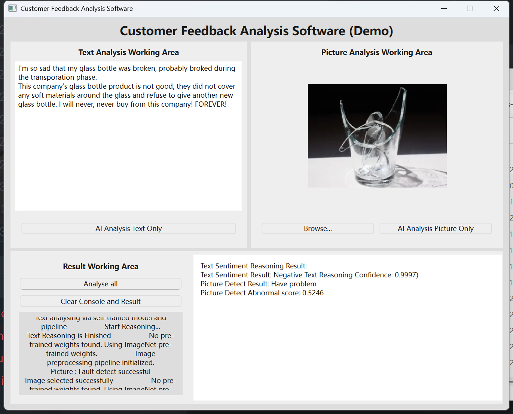

# Assignment: Customer feedback analysis software demo

> **Author : Yang Yi**
> 
> **Matricular Number : N2504320D**
***
## Description
This project is a demo of customer feedback analysis software. Including text sentiment analysis
and image anomaly detection.<br>

**Model Used :** 
- Self-trained text sentiment model, dataset from kaggle (See appendix below)
- Transformer pipeline for text sentiment analysis
- The pre-trained WideResNet50 model of PyTorch [Download .pth file](https://download.pytorch.org/models/wide_resnet50_2-95faca4d.pth)

## Result Presenting
<p align="center">
  
</p>

## Environment Settings
**Python Interpreter :** ```Python 3.13.2```  
**Install Libraries :**
```powershell
# Windows PowerShell
pip install uv
uv sync
pip install anomalib[vlm_clip]
```
**Demo Entrance :** ```main.py```
**Model Training Entrance :** ```model_trainer/main_model_train.py```

## How to Use
1. Set up environment
2. Download model file from [here]()
3. Insert model file, where the file path should be ```Customer-feedback-analysis-software-demo/model```
4. Run ```main.py``` to start the demo.

## Trained Source Used
1. Mark Kaghazgarian : Sentiment Labelled Sentences Data Set, Kaggle. [Redirect](https://www.kaggle.com/datasets/marklvl/sentiment-labelled-sentences-data-set?resource=download)
2. Rahul Kumar : Sentiment Labelled Sentences Data Set, Kaggle. [Redirect](https://www.kaggle.com/datasets/rahulin05/sentiment-labelled-sentences-data-set/data)
3. Wali M. Ahmad : Amazon Sentiment Spectrum: Reviews Dataset. [Redirect](https://www.kaggle.com/datasets/walimuhammadahmad/amazone-reviews/data)